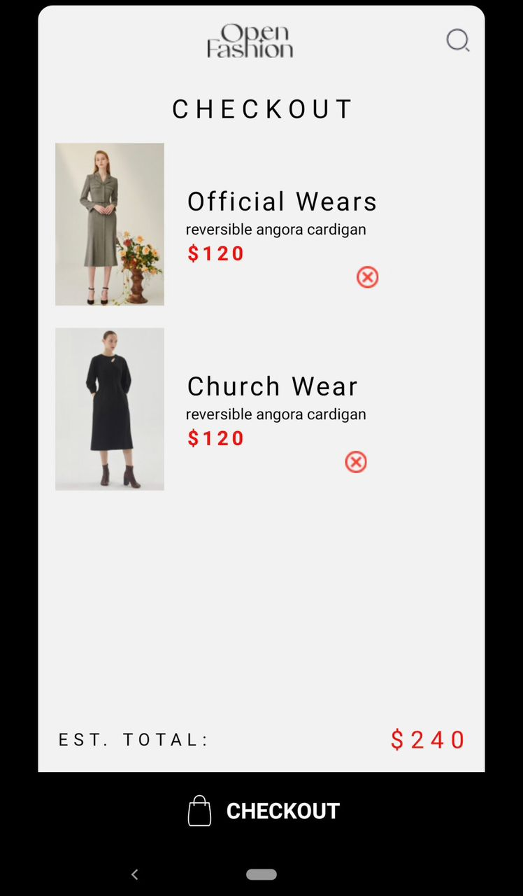
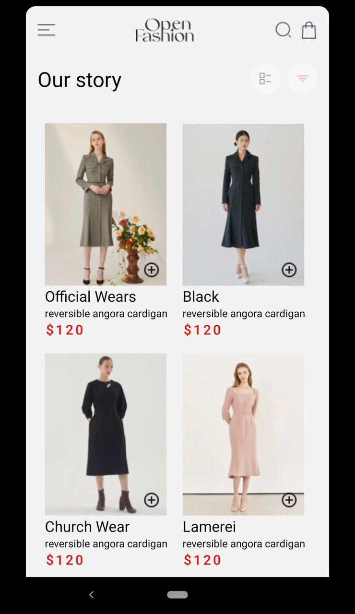
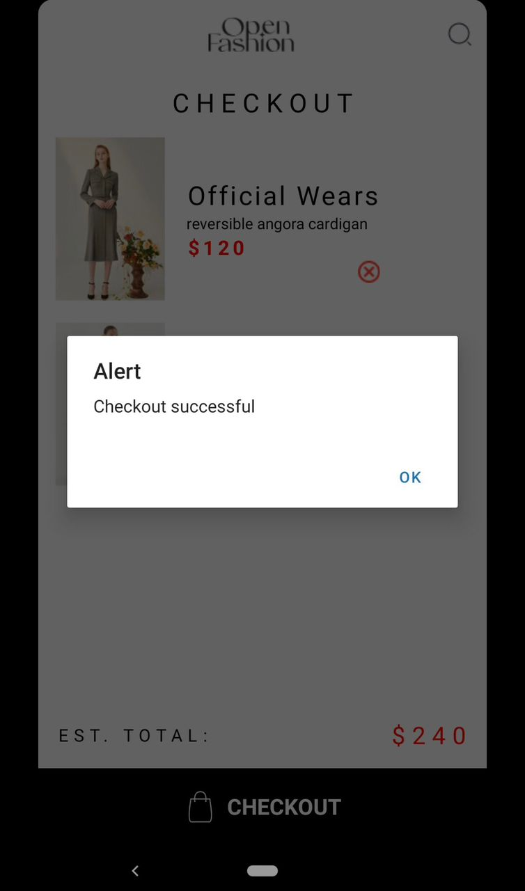

### Overview of a React Native Shopping Application
The goal of this project is to create a mobile shopping application that makes it easy for customers to browse and buy dresses. With its easy-to-use layout, the app makes shopping more straightforward by letting users examine several outfit alternatives, put them in their shopping bags, and check out.

### Features
Look through a selection of dresses.
Put gowns in a shopping bag.
Go to the checkout to finish your shopping.
### Technologies Employed
React Native is a well-liked framework for creating JavaScript and React native mobile applications.
## Expo: 
Makes developing and deploying React Native apps easier.
A React Native application's screen navigation is made possible using React Navigation.

### Technologies Used React Native: 
React and JavaScript are used to create popular frameworks for native mobile applications.
## Expo: 
Makes developing and deploying React Native apps easier.

A React Native application's screen navigation is made possible using React Navigation.
Beginning
Before beginning this project, make sure your machine is configured to run Node.js. Next, do the following actions:

Make a local copy of the repository on your computer.
Go to the project directory by navigating.
Npm install must be used to install the required dependencies.
Npm start should be used to launch the development server.
Launching the Program
Run npm run android to launch the application on an Android device or emulator. Use npm run ios for iOS.

### How Async Storage Works

# Initialization:
Installing an async storage library, such as AsyncStorage, in your React Native app is the first step. The ability to store and retrieve data asynchronously is offered by this library.

# Data Storage:
The AsyncStorage library provides a method called setItem() for storing data. This method takes two parameters:
The key is the first parameter, which is a string that identifies the data being stored.
The second parameter is the value, which is the data that will be stored.

# Data Retrieval:
The AsyncStorage library provides a method called getItem() for retrieving data. This method takes one parameter, which is the key of the data that you want to retrieve.

## Making Contributions:
 We appreciate your efforts to make the application better. Kindly do not hesitate to make a pull request.

### Screenshots 

